# Hi 👋, I'm Chaitanya Bhore

### Computer Engineering Student | .NET Developer | Python & DSA Enthusiast

## 👨‍💻 About Me

I'm a Computer Engineering student passionate about building practical software and continuously improving my problem-solving skills.

- 🔭 Currently working on **.NET / ASP.NET Core projects**
- 🐍 Learning **Python and Data Structures & Algorithms**
- 🗄️ Working with **SQL and databases**
- 🚀 Interested in **backend development, software engineering, and real-world applications**
- 💡 I enjoy turning ideas into working projects and learning through hands-on development

## 🚀 Featured Projects

### 📝 Leave Management System

A web-based application for managing employee leave requests, leave types, and related records.

**Tech:** C# • ASP.NET Core MVC • Entity Framework Core • SQL Server

🔗 [View Repository](https://github.com/Chaitanya-Bhore/LeaveManagementSystem)

## 🚧 In Progress
### 📚 Scriptoria

A platform for writers and readers to create, organize, publish, and explore different forms of written content.

Status: 🟡 Early Development

Tech: .NET • C# • ASP.NET Core • SQL

Scriptoria is currently in the early stages of development and will be expanded as development progresses.

🔗 [View Repository](https://github.com/Chaitanya-Bhore/Scriptoria)

## 📚 Currently Learning

- 🐍 **Python** — building a strong programming foundation
- 🧠 **Data Structures & Algorithms** — preparing to start structured problem-solving practice
- ⚙️ **ASP.NET Core & Entity Framework Core** — improving my backend development skills
- 🗄️ **SQL & Database Management** — strengthening database concepts and practical usage

## 🎯 Goals

- 🚀 Building real-world applications with **C# and .NET**
- 🧠 Strengthening **Data Structures & Algorithms**
- 🐍 Expanding my **Python** skills
- 🌐 Improving my **backend development and database** knowledge
- 💡 Turning ideas into practical, usable software

## 🛠️ Languages & Tools

  

 ## 📊 GitHub Statistics

  

## 💻 Top Languages

  

## 🔥 GitHub Streak

  

## 🤝 Connect With Me

  

